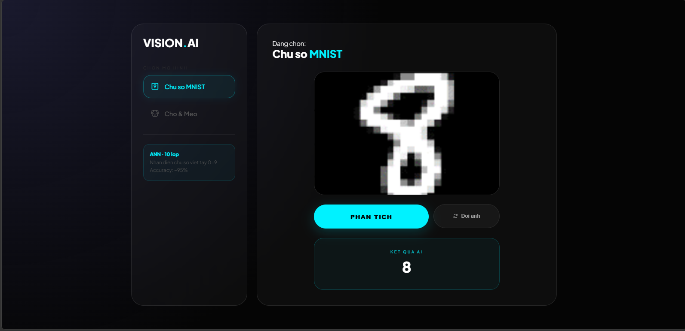
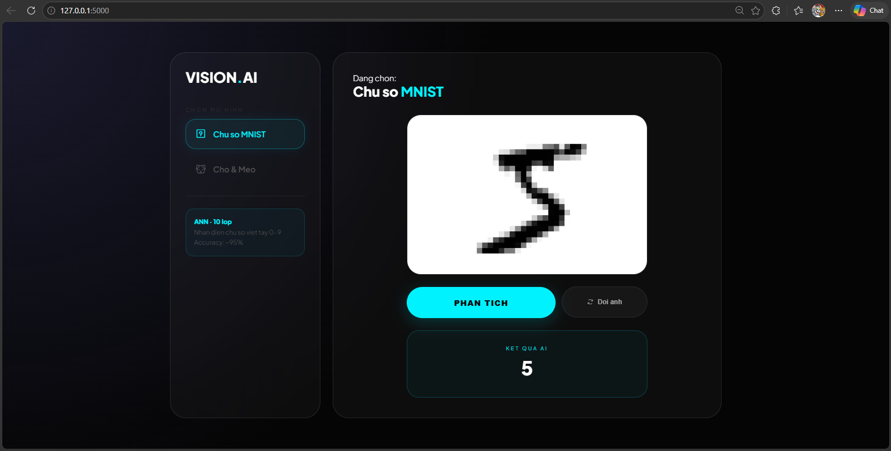
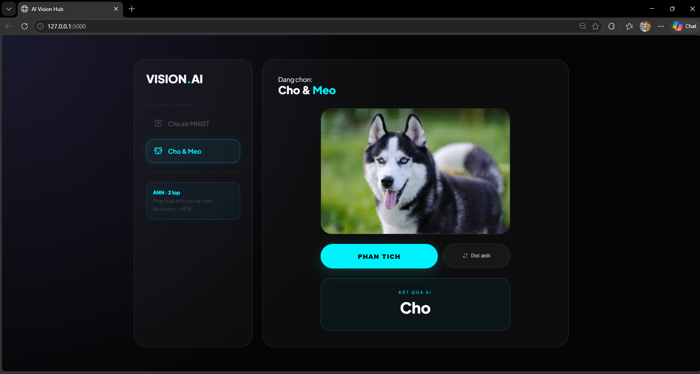
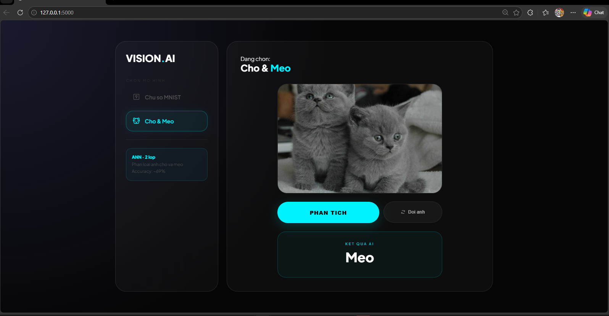

# DEEP LEARNING

- **Sinh viên thực hiện:** Phạm Thế Hùng  
- **MSSV:** 2374802010164  
- **Môn học:** Giới Thiệu Học Sâu  
- **Giảng viên:** Nguyễn Thái Anh

## BÀI TẬP QUA TẾT - ANN2

### Công nghệ sử dụng
- **Python 3**
- **PyTorch** (dùng `torch.nn`, `torch.optim`)
- **Torchvision** (tăng cường, tiền xử lý hình ảnh)
- **NumPy & Matplotlib** (vẽ đồ thị Loss / Accuracy)
- **Flask** (Web backend API)
- **HTML/CSS/JS** (Giai diện Web App Dark Mode)

---

## Phần 1: Tập dữ liệu chữ số MNIST

### Cách hoạt động
- **Chuẩn bị dữ liệu:** Tải bộ ảnh chữ số viết tay MNIST (60,000 ảnh train, 10,000 ảnh test) và chuyển sang dạng **Tensor** để PyTorch xử lý.
- **Xây dựng mô hình ANN:**
  - **Đầu vào:** Biến ảnh 28x28 thành chuỗi 784 nơ-ron.
  - **Lớp ẩn:** 1 lớp 128 nơ-ron dùng hàm kích hoạt **ReLU**.
  - **Lớp đầu ra:** 10 nơ-ron tương ứng với 10 chữ số (0-9).
- **Huấn luyện và tối ưu:**
  - **Hàm mất mát:** `CrossEntropyLoss`.
  - **Optimizer:** `Adam` (learning rate = 0.01).
  - Lan truyền ngược (`loss.backward()`) và cập nhật trọng số (`optimizer.step()`) trong 50 epoch.

### Kết quả
- Mô hình hội tụ rất nhanh và ổn định. 
- Độ chính xác trên tập kiểm tra (Test Set) đạt **95.20%**.

---

## Phần 2: Tập dữ liệu Cat and Dog (Chó và Mèo)

### Cách hoạt động
- **Chuẩn bị dữ liệu:** Đọc ảnh từ hệ thống, cắt cho đều nhau về độ phân giải **64x64 pixel** màu RGB (3 kênh), chuyển hóa thành khoảng `-1` đến `1` dạng Tensor.
- **Xây dựng mô hình ANN (Mở rộng & Tối ưu):**
  Thử nghiệm mô hình sử dụng hàm tuần tự `nn.Sequential` với lượng Layer lớn hơn cùng kỹ thuật `BatchNorm` và `Dropout` để tránh Overfitting. Thiết kế mạng như sau:
  - **Đầu vào:** Duỗi ảnh thành chuỗi nơ-ron dài 12,288 (64 x 64 x 3 kênh).
  - **Lớp ẩn 1:** 2048 nơ-ron + BatchNorm + ReLU + Dropout(0.4)
  - **Lớp ẩn 2:** 1024 nơ-ron + BatchNorm + ReLU + Dropout(0.3)
  - **Lớp ẩn 3:** 256 nơ-ron + BatchNorm + ReLU + Dropout(0.3)
  - **Lớp đầu ra:** 2 nơ-ron để xuất vector Logits nhận loại chó hoặc mèo.
- **Huấn luyện và tối ưu:**
  - **Hàm mất mát:** `CrossEntropyLoss`.
  - **Optimizer:** `Adam` (learning rate nhỏ = 0.0005, giúp hội tụ mượt mà).
  - Huấn luyện nhiều epoch liên tục (lên đến 250).

### Kết quả
- Việc nhận diện chó mèo khó khăn hơn so với bộ dữ liệu đen trắng. Độ chính xác trên tập Train đạt 92.05%.
- Độ chính xác trên tập kiểm tra (Test Set) đạt **69.35%**. Kiến trúc cải tiến kết hợp Dropout/BatchNorm đã nâng độ nhận diện lên đáng kể so với những mạng lưới ANN cơ bản.

---

## Phần 3: Tích hợp Flask Web App

Để kiểm chứng hai file trọng số lượng (*Weights: `ANN_MNIST.pth` và `ann_cat_and_dog_model.pth`*). Dự án xây dựng một hệ thống Website App AI cực kì trực quan.

### Điểm nổi bật
1. **Tiền xử lý thực tế tốt:**
   - Khi người dùng đưa nét chữ đen trên nền giấy trắng hệ thống Web sẽ tự động dùng hàm `Lambda` của PyTorch chèn thuật toán nghịch đảo màu (`1 - x`) sang dạng trắng trên đen (tiêu chuẩn MNIST). Đảm bảo nhận loại vượt trội với nét vẽ bên ngoài thực tiễn mang vào.
2. **Giao diện đa khung hình (AI Vision Hub):**
   - Thiết kế UI chuẩn Dark Mode mang đậm chất phòng Lab Studio đồ họa. Trải nghiệm bắt mắt.
   - Thao tác kéo thả upload hình ảnh (Drag & Drop). Hiển thị song song bản gốc ngay trong box.
3. **Truy vấn Động (Fetch API):**
   - Không cần load lại Web. Nhấn là có ngay kết quả của AI trả ra màn hình ở thời gian thực.
   - Giao diện có thanh trạng thái đánh giá độ chuẩn xác (Confidence %) của kết quả dưới dạng Bar Chart mượt mà. 
4. **Nhiều Modules phân tách Tab:** 
   - Side menu của app phép người dùng bấm chuyển chế độ AI giữa `Chữ số MNIST` và dự đoán `Chó / Mèo`.

### Cài đặt và sử dụng Web
Tại thư mục gốc, ở chế độ Bash/Command gõ:
```bash
python app.py
```
App sẽ Start một HTTP Host  chỉ việc truy cập URL **http://127.0.0.1:5000** để tiến hành tương tác nhận dạng hình
#### Demo giao diện web



