# DEEP LEARNING

- **Sinh viên thực hiện:** Phạm Thế Hùng  
- **MSSV:** 2374802010164  
- **Môn học:** Giới Thiệu Học Sâu  
- **Giảng viên:** Nguyễn Thái Anh

## CNN
### Công nghệ sử dụng
- **Python 3**  
- **PyTorch**
- **Torchvision**
- **Matplotlib**
- **Numpy**
- **Flask** (ứng dụng web phục vụ dự đoán ảnh)

## Bài tập về nhà

### Bài 1: Phân loại tập dữ liệu Cat and Dog

**Cách hoạt động:**
- Sử dụng mô hình `CatDog_CNN` thuần không dùng pre-trained model gồm 4 khối tích chập mỗi khối gồm 2 tầng Conv2d, BatchNorm, và MaxPool kết hợp với tầng Dropout (0.5) ẩn và tầng Linear để dự đoán 2 lớp (Cat/Dog).
- Áp dụng các kỹ thuật tăng cường dữ liệu (Data Augmentation) đa dạng trên tập huấn luyện để chống học vẹt: `Resize(132, 132)`, `RandomCrop(128)`, `RandomHorizontalFlip`, `RandomRotation(15)`, và `ColorJitter`.
- Tối ưu hóa mô hình bằng thuật toán Adam (`lr=0.001`, `weight_decay=1e-4`) kết hợp bộ điều chỉnh learning rate `StepLR` (giảm lr đi 1/2 sau mỗi 10 epoch).
- Quá trình huấn luyện kéo dài trong 50 epoch với batch size là 64.

**Kết quả:**
- Hàm mất mát giảm liên tục và độ chính xác của tập train hội tụ cực kì tốt ở mức **97.53%** với loss giảm xuống 0.0678 ở chu kỳ cuối cùng.
- Độ chính xác đo được trên tập kiểm tra (test set) đạt **94.75%**, đáp ứng tốt chỉ tiêu độ chính xác vượt qua 90% và mô hình hoàn toàn tránh được rủi ro bị overfitting nhờ vào các kỹ thuật ngăn ngừa mạnh mẽ.

### Bài 2: Phân loại tập dữ liệu CIFAR-10

**Cách hoạt động:**
- Thiết lập kiến trúc mạng `CIFAR10_CNN` gồm 3 khối tích chập lớn (từng khối chứa tuần tự Conv2d, BatchNorm, MaxPool) nối tiếp bởi tầng Fully Connected và Dropout (0.5).
- Tăng cường dữ liệu ảnh đầu vào bằng các kỹ thuật như: `RandomCrop(32, padding=4)` kết hợp với `RandomHorizontalFlip`, và cuối cùng chuẩn hóa bằng `Normalize` với các bộ tham số trung bình chuẩn của CIFAR-10.
- Sử dụng Optimizer Adam (`lr=0.001`, bù trừ trọng số `weight_decay=1e-4`) và `StepLR` giảm learning rate sau mỗi 15 epoch. 
- Mô hình được đưa vào huấn luyện sâu trong 80 epoch.

**Kết quả:**
- Độ chính xác của tập huấn luyện tăng đều đặn, ở cuối quá trình luyện đạt mức **98.26%** (loss còn 0.0518).
- Trên tập kiểm tra (test set), độ chính xác ổn định tại **90.27%**. Tập dữ liệu lớn với 10 nhãn đa dạng, nhưng nhờ cấu trúc phân tầng chi tiết, mô hình tự xây dựng vẫn hiểu được các khối tính năng phức tạp để phân tách.

### Bài 3: Phân loại tập dữ liệu PlantVillage

**Cách hoạt động:**
- Xây dựng mô hình `PlantVillage_CNN` gồm 4 khối tích chập tập trung vào trích xuất đặc trưng với hàm kích hoạt ReLU, MaxPool2d, và lớp chuẩn hóa Batch Normalization để duy trì tốc độ hội tụ định hướng.
- Sử dụng các kỹ thuật tăng cường dữ liệu: `RandomHorizontalFlip`, `RandomVerticalFlip`, `RandomRotation(45)`, và `ColorJitter` để tạo dữ liệu đa dạng giúp quá trình học được tối ưu.
- Thực hiện huấn luyện trong 30 epoch sử dụng thuật toán Adam (`lr=0.001`, `weight_decay=1e-4`) và `StepLR` (giảm learning rate sau mỗi 15 epoch).

**Kết quả:**
- Mất mát giảm dần, đạt điểm cực tiểu 0.0746 với độ chính xác đạt gần **97.63%** trên tập huấn luyện.
- Mô hình giữ nhịp phân loại trên tập test vô cùng xuất sắc với độ chính xác tuyệt đối ở mức **98.68%**. Giải pháp Augmented data bằng thư viện PyTorch Transforms rất tốt khi giải quyết được tập dữ liệu này.

### Giao diện web — AI Vision

Dự án kèm một **ứng dụng web** để thử nghiệm trực tiếp ba mô hình CNN đã huấn luyện, không cần chạy notebook.

**Cách hoạt động:**
- Backend dùng **Flask** (`app.py`): nạp trọng số từ các file `.pth` tương ứng (`cat_and_dog_model.pth`, `CIFAR10_model.pth`, `PlantVillage_model.pth`), tiền xử lý ảnh (resize, normalize ImageNet) và trả về nhãn dự đoán dạng JSON.
- Giao diện nằm trong `templates/index.html`: layout dạng dashboard tối (glassmorphism), font Plus Jakarta Sans và icon Phosphor.
- Sidebar cho phép chọn **ba chế độ** khớp với ba bài tập: **Chó & Mèo** (`catdog`), **CIFAR-10** (`cifar10`), **Plant Village** (`plant`).
- Người dùng **tải ảnh lên** (click hoặc kéo thả vào vùng preview), bấm **Phân tích ngay**; frontend gửi `POST /predict` kèm `file` và `model_id`, hiển thị kết quả trong khung “Kết quả AI”.

**Chạy thử:**
1. Đặt các file trọng số `.pth` cùng thư mục với `app.py`
2. Cài đặt phụ thuộc (Flask, PyTorch, Pillow, …) nếu chưa có.
3. Chạy: `python app.py` — mặc định máy chủ phát triển lắng nghe cổng **5007** (`http://127.0.0.1:5007`).

**Lưu ý:** Nếu thiếu file `.pth` cho một mô hình, chế độ đó sẽ không được nạp; chỉ các mô hình load thành công mới dùng được trên web.

### Ảnh Demo Của Web
#### Cat and dog
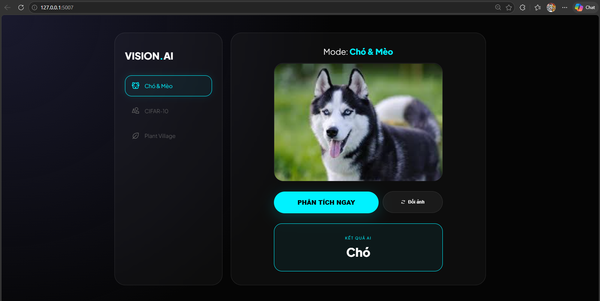
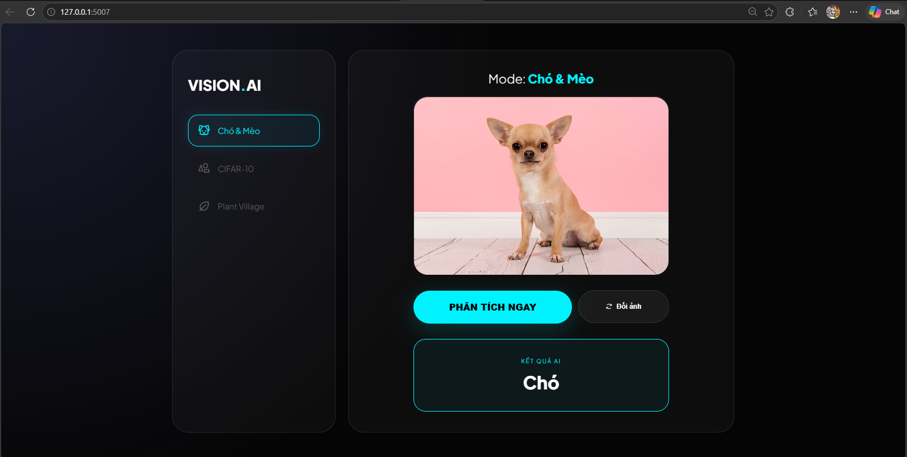
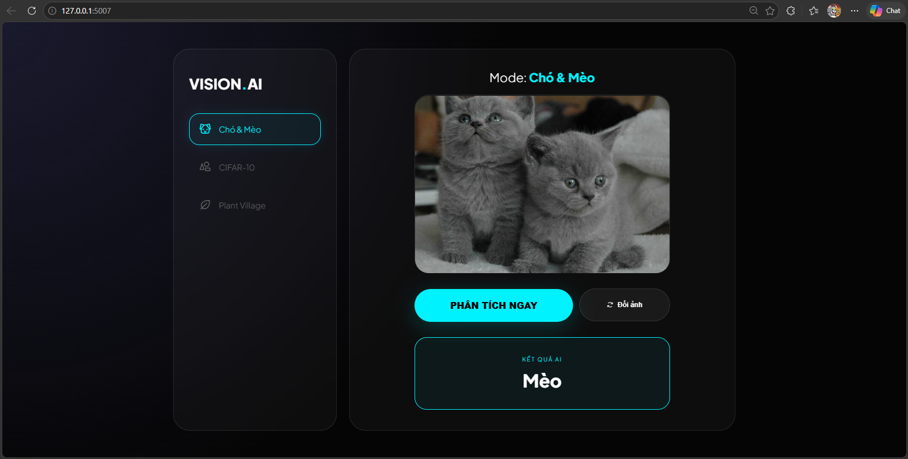
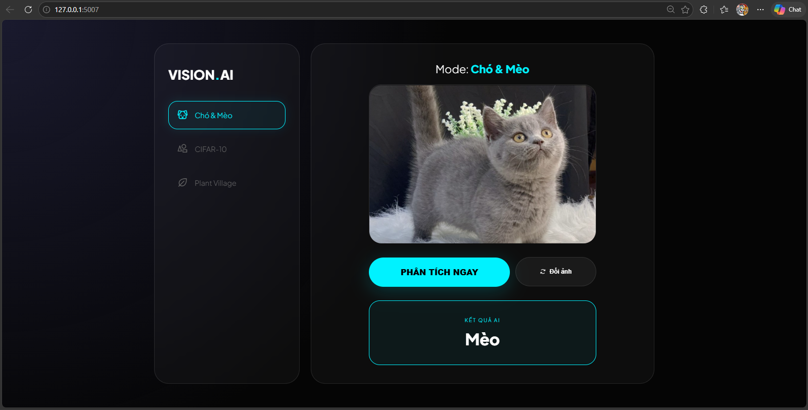

#### CIFAR10
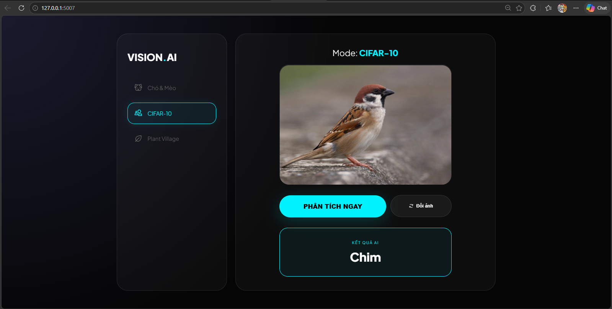
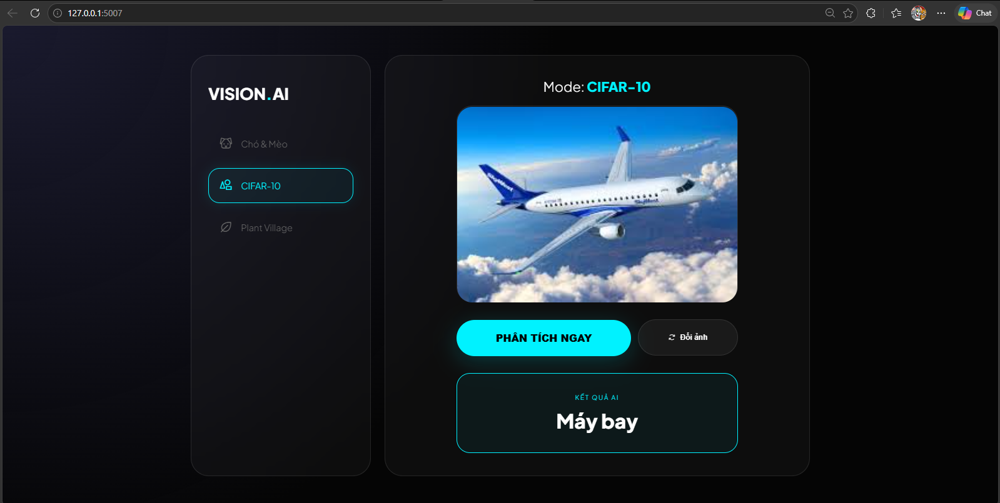
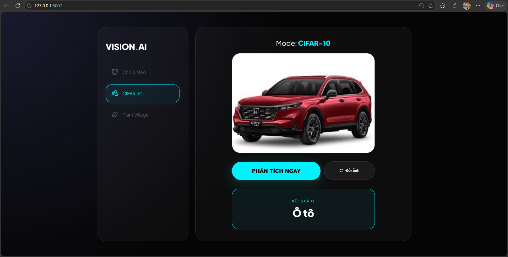
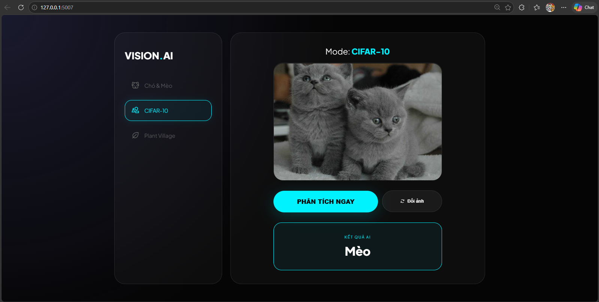
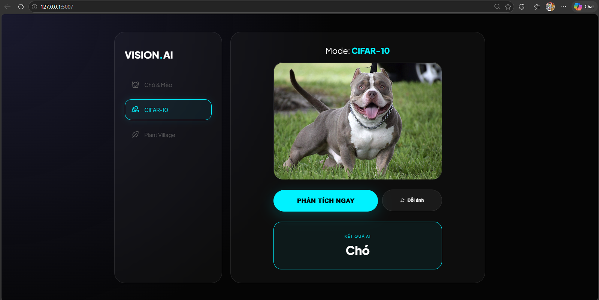
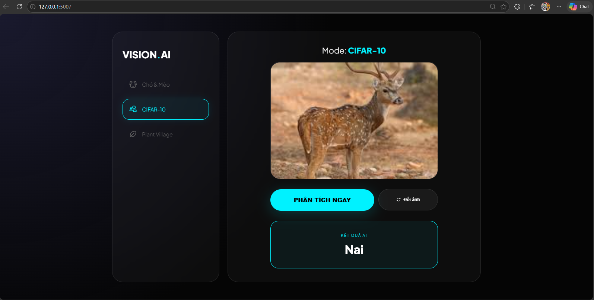
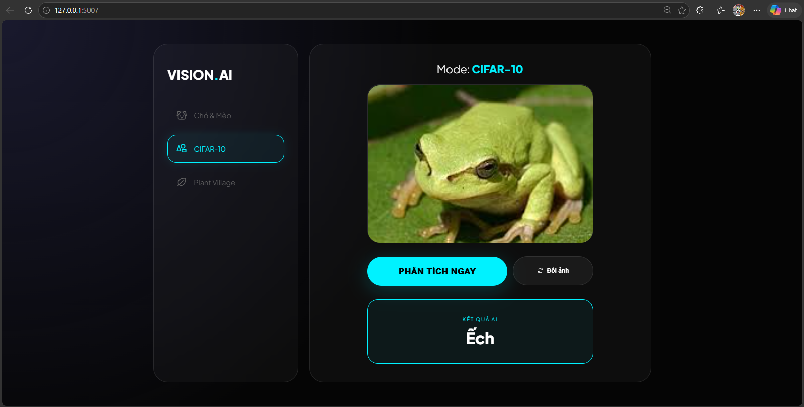
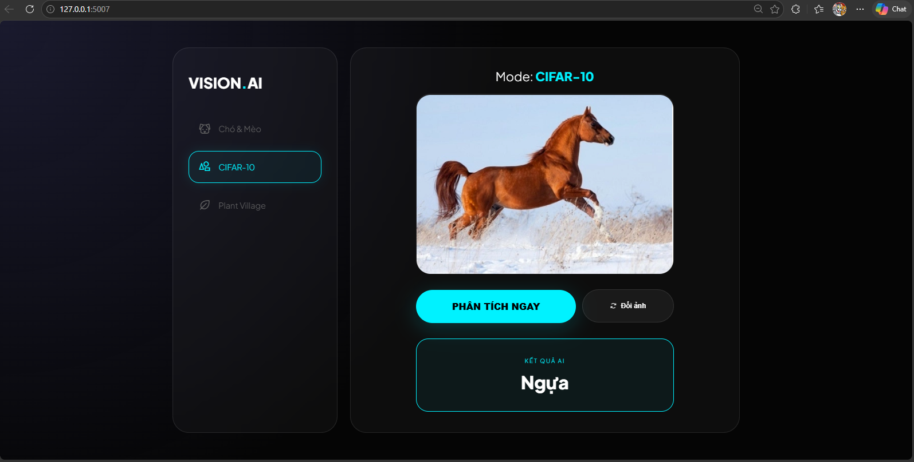
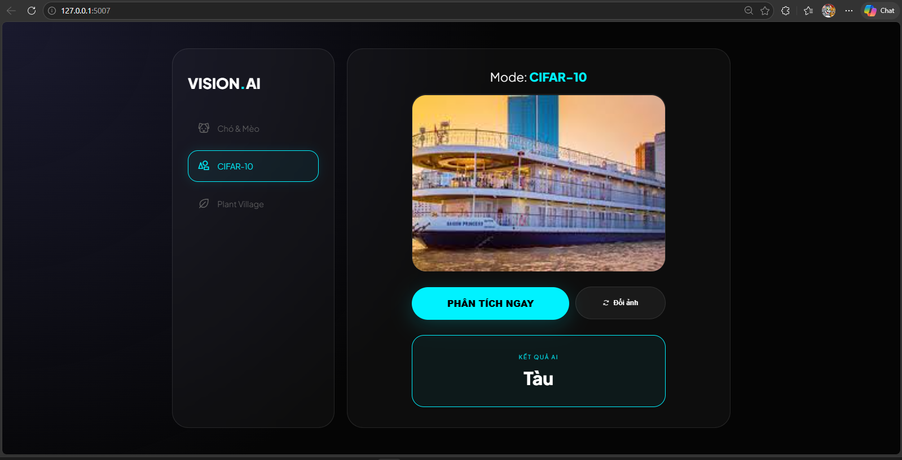

#### PlanVilage
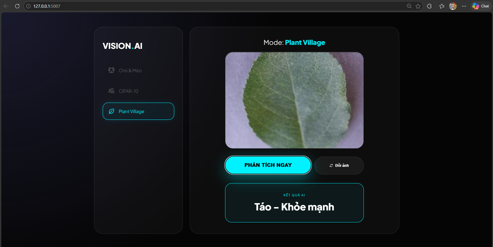
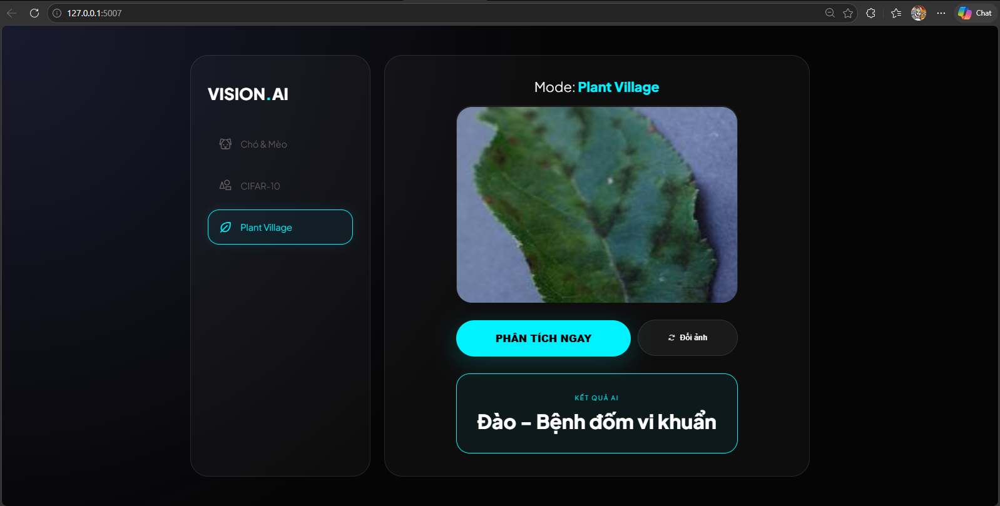
